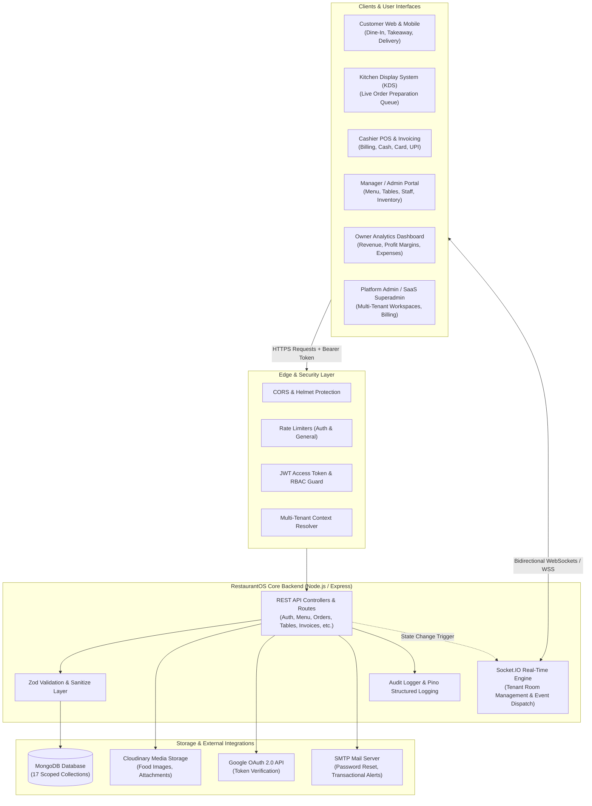
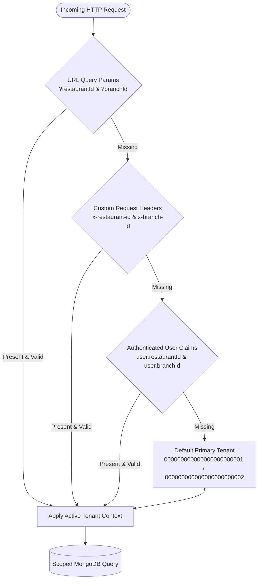
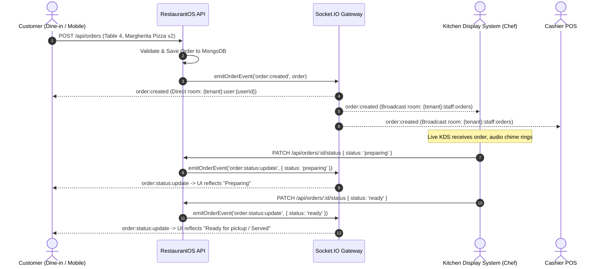
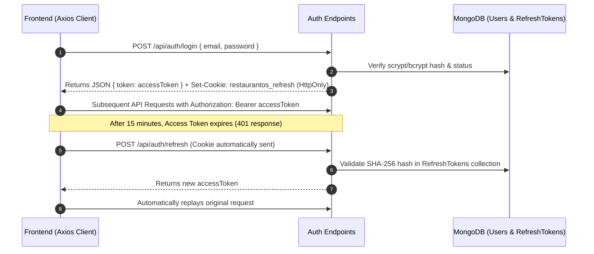
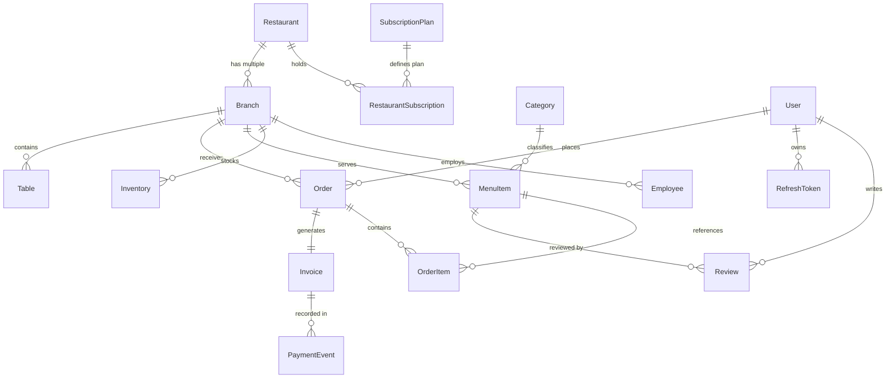

# RestaurantOS - System Architecture & Technical Design

This document details the architectural principles, data flow, multi-tenancy model, security enforcement, and real-time infrastructure powering **RestaurantOS (Yogi)**.

---

## 1. High-Level Architecture Overview

RestaurantOS is built on a modern decoupled architecture:
1. **Presentation Layer (Frontend):** High-speed Single Page Application (SPA) built with React 19, TypeScript, and Vite 8, styled with Tailwind CSS v4.
2. **Application / API Gateway Layer (Backend):** Stateless Node.js (ESM) REST API and WebSocket Gateway built on Express 4.18 and Socket.IO.
3. **Data Persistence Layer:** MongoDB document database managed via Mongoose ODM schemas with compound multi-tenant indexing.



---

## 2. Multi-Tenant SaaS Architecture

RestaurantOS operates as a **hierarchical multi-tenant platform**:
- **Organization Level:** `Restaurant` (Tenant organization, branding, global policies).
- **Location Level:** `Branch` (Physical restaurant outlet, cloud kitchen, food court stall).

### 2.1 Tenant Context Resolution

Every operational collection (`MenuItem`, `Category`, `Table`, `Order`, `Invoice`, `Inventory`, `Employee`, `Offer`, etc.) contains:
```typescript
{
  restaurantId: Types.ObjectId, // References Restaurant
  branchId: Types.ObjectId     // References Branch
}
```

The backend extracts and asserts the active tenant context using a 4-tier resolution hierarchy:



### 2.2 Strict Data Isolation

On every write and update operation, the backend asserts tenant alignment:
```typescript
export function assertTenantMatch(document: any, tenant: { restaurantId: string; branchId: string }) {
  return String(document?.restaurantId) === tenant.restaurantId && String(document?.branchId) === tenant.branchId;
}
```
This guarantees cross-tenant data leakage is completely prevented even in misconfigured client requests.

---

## 3. Real-Time Infrastructure (WebSockets)

Real-time capabilities are orchestrated via **Socket.IO** with authenticated, tenant-isolated room architectures:



### WebSocket Channel Taxonomy

When a client establishes a socket connection:
1. The socket handshake verifies the JWT Access Token in `socket.handshake.auth.token`.
2. The user is automatically joined to their private channel:
   - `{tenant}:user:{userId}`
3. If the user has a staff role (`chef`, `cashier`, `manager`, `owner`, `platformAdmin`), they join:
   - `{tenant}:staff:orders`
4. The client's frontend `orderSyncStore` triggers real-time reactivity without polling.

---

## 4. Authentication & Security Architecture

### 4.1 Double-Token Architecture

To ensure protection against both XSS (Cross-Site Scripting) and CSRF (Cross-Site Request Forgery):

| Token Type | Storage Location | Lifetime | Purpose |
| :--- | :--- | :--- | :--- |
| **Access Token** | Memory / Authorization Header (`Bearer`) | 15 Minutes | Short-lived token for authorizing API requests. |
| **Refresh Token** | `HttpOnly`, `SameSite`, `Secure` Cookie | 7 Days | Long-lived cryptographically signed token for refreshing access. |



### 4.2 Security Defenses
- **Timing-Safe Crypto:** Password verification and webhook signature checks utilize `crypto.timingSafeEqual` to eliminate timing attacks.
- **Hashed Stored Refresh Tokens:** Refresh tokens stored in the database are hashed with SHA-256 so that a database breach does not leak active session tokens.
- **Strict Role-Based Access Control (RBAC):** Every route checks permissions using `hasPermission(role, permission)`.
- **Zod Schema Validation:** Every incoming request body and query is checked against strict Zod definitions. Unexpected properties are stripped or rejected.
- **IP & Account Rate Limiting:** Brute-force protection on `/api/auth/*` (maximum 50 requests per 15 minutes per IP/account in production).
- **Helmet Security Headers:** Automatic headers for HSTS, X-Content-Type-Options, X-Frame-Options, and Content Security Policies.

---

## 5. Frontend Architecture & State Management

The frontend uses **Zustand** stores designed for clean separation of concerns:

| Store | File Location | Responsibility |
| :--- | :--- | :--- |
| **`useAuthStore`** | `src/store/authStore.ts` | Current user session, authentication state, login/register/logout actions. |
| **`useTenantStore`** | `src/store/tenantStore.ts` | Active restaurant and branch selection, geolocation nearest branch calculation. |
| **`useCartStore`** | `src/store/cartStore.ts` | Client-side shopping cart, item quantities, special instructions, coupons. |
| **`useKitchenStore`** | `src/store/kitchenStore.ts` | Live orders feed for chefs, cooking timers, status management. |
| **`useCashierStore`** | `src/store/cashierStore.ts` | POS billing desk, split payments, invoice generation, receipts. |
| **`useOrderSyncStore`** | `src/store/orderSyncStore.ts` | Real-time synchronization bus bridging Socket.IO events to React components. |
| **`useThemeStore`** | `src/store/themeStore.ts` | Dark mode and light mode preferences persisted in localStorage. |
| **`useToastStore`** | `src/store/toastStore.ts` | Floating notification alerts across all views. |

---

## 6. Database Entity Relationship Model


