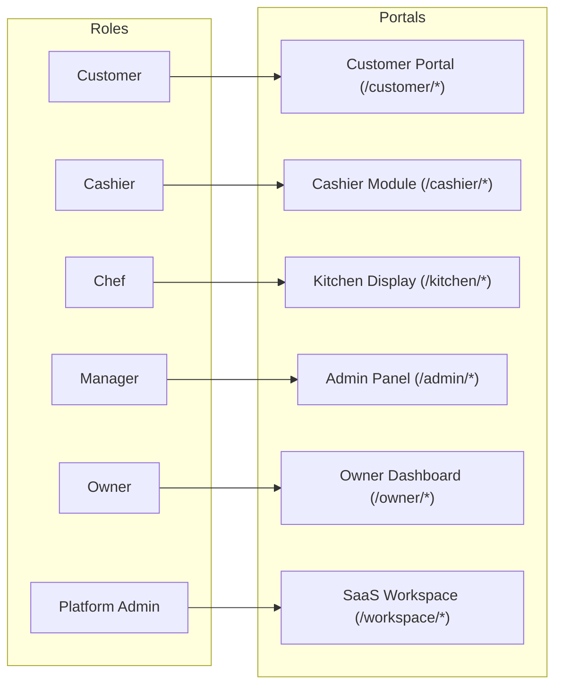

# RestaurantOS - User Roles & Operational Workflows

RestaurantOS provides a tailored experience for 6 distinct personas across the restaurant lifecycle. This document outlines the role hierarchy, route accessibility, and step-by-step user journeys.

---

## 1. Role & Permission Matrix

| Capability / Resource | Customer | Cashier | Chef (Kitchen) | Manager | Owner | Platform Admin |
| :--- | :---: | :---: | :---: | :---: | :---: | :---: |
| **Browse Menu & Nutritional Info** | ✅ | ✅ | ✅ | ✅ | ✅ | ✅ |
| **Scan Table QR & Place Orders** | ✅ | ✅ | ❌ | ✅ | ✅ | ✅ |
| **Track Personal Orders** | ✅ | ❌ | ❌ | ✅ | ✅ | ✅ |
| **Write Dish Reviews & Ratings** | ✅ | ❌ | ❌ | ✅ | ✅ | ✅ |
| **Kitchen Display (KDS) Live Feed** | ❌ | ❌ | ✅ | ✅ | ✅ | ✅ |
| **Update Preparation State (`preparing` / `ready`)** | ❌ | ❌ | ✅ | ✅ | ✅ | ✅ |
| **POS Billing & Payment Collection** | ❌ | ✅ | ❌ | ✅ | ✅ | ✅ |
| **Generate & Print Invoices** | ❌ | ✅ | ❌ | ✅ | ✅ | ✅ |
| **Manage Menu Items & Categories (CRUD)** | ❌ | ❌ | ❌ | ✅ | ✅ | ✅ |
| **Manage Tables & Generate QR Codes** | ❌ | ❌ | ❌ | ✅ | ✅ | ✅ |
| **Inventory Stock Tracking & Alerts** | ❌ | ❌ | ❌ | ✅ | ✅ | ✅ |
| **Staff Directory & Shift Management** | ❌ | ❌ | ❌ | ✅ | ✅ | ✅ |
| **Branch Operational Settings** | ❌ | ❌ | ❌ | ✅ | ✅ | ✅ |
| **Executive Revenue & Expense Analytics** | ❌ | ❌ | ❌ | ❌ | ✅ | ✅ |
| **Manage Restaurant Subscription Plan** | ❌ | ❌ | ❌ | ❌ | ✅ | ✅ |
| **Multi-Tenant SaaS Workspace (All Outlets)** | ❌ | ❌ | ❌ | ❌ | ❌ | ✅ |
| **Manage Global SaaS Subscription Tiers** | ❌ | ❌ | ❌ | ❌ | ❌ | ✅ |

---

## 2. Route & Screen Access by Persona

---

## 3. Detailed Operational Workflows

### Workflow 1: Customer Table QR Dine-In Ordering

1. **Scan & Open:** The customer sits at Table 4 and scans the printed table QR code with their mobile phone.
2. **Auto-Resolution:** The URL `https://app.example.com/scan/table/:token` resolves the token to Restaurant ID, Branch ID, and Table #4.
3. **Explore Menu:** The customer browses categorized items, views food images, dietary tags (vegetarian, spicy), allergens, and preparation time.
4. **Customize & Add to Cart:** Items are added to the cart with optional special cooking instructions (e.g., *"Less spice, no garlic"*).
5. **Review & Checkout:**
   - Order type is pre-locked to `dine-in` with Table #4 assigned.
   - Customer applies coupon code `SAVE10` if eligible.
   - Taps **Place Order**.
6. **Live Order Tracking:**
   - The browser redirects to `/customer/order-tracking/:orderId`.
   - Real-time status steps animate from **Confirmed** ➔ **Preparing in Kitchen** ➔ **Food Ready** ➔ **Completed**.

---

### Workflow 2: Kitchen Display System (KDS) Order Execution

1. **Instant Notification:** When an order is placed, the kitchen display at `/kitchen/live-orders` chimes and displays the new ticket in the **Pending** queue.
2. **Review Ticket:** The chef sees:
   - Order number, table number, order time elapsed.
   - List of dishes with quantities and highlighted special instructions.
3. **Start Cooking:** Chef clicks **Accept / Start Preparing**.
   - Order status transitions to `preparing`.
   - Live timer counts up the cooking duration.
   - Customer's tracking screen instantly updates via WebSocket.
4. **Mark as Ready:** Once plating is complete, chef clicks **Mark Ready**.
   - Waitstaff / customer receives instant notification that the food is ready for serving.
5. **Completion:** When picked up by waitstaff, click **Complete** to archive the ticket to `/kitchen/completed`.

---

### Workflow 3: Cashier POS Billing & Settlement

1. **Open POS Desk:** Cashier logs in and navigates to `/cashier/billing`.
2. **Select Active Order:** Cashier selects the customer's open order (or builds an ad-hoc takeaway order directly).
3. **Review Bill:** The system computes subtotal, active discounts, and statutory taxes.
4. **Process Payment:**
   - Cashier selects payment method: **Cash**, **Card**, **UPI**, or **Split Payment**.
   - If cash, enters amount tendered; system displays exact change return.
   - If UPI/Card, records transaction reference ID.
5. **Issue Invoice:**
   - Clicks **Generate Invoice**.
   - System prints thermal receipt or downloads formatted PDF.
   - The associated table status is automatically reset to `cleaning` or `available`.

---

### Workflow 4: Manager Outlet Operations & Table QR Setup

1. **Login & Dashboard:** Manager accesses `/admin/dashboard` to monitor active tables, daily order volume, and low-stock alerts.
2. **Menu Updates:** In `/admin/menu`, manager can toggle dish availability (e.g., mark *"Salmon"* as out-of-stock when fresh delivery runs out) or adjust prices.
3. **Generating Table QR Codes:**
   - Navigates to `/admin/tables`.
   - Selects Table #5 ➔ clicks **Generate QR Code**.
   - System displays the branded QR code with the direct ordering link.
   - Manager downloads and prints the QR standee for the table.
4. **Inventory Reorder:** In `/admin/inventory`, view ingredients below the minimum threshold. Update stock quantities after supplier delivery.

---

### Workflow 5: Owner Financial Oversight

1. **Executive Summary:** Owner opens `/owner/dashboard` to view consolidated metrics across branches:
   - Net Revenue vs. Operating Expenses.
   - Average Order Value (AOV).
   - Profit Margin percentages.
2. **Trend Analysis:** Navigates to `/owner/revenue` and `/owner/analytics` to compare sales across day parts (Lunch vs. Dinner) and identify top revenue dishes.
3. **Subscription Management:** In `/owner/subscription`, view current plan tier, active period, and upgrade features.

---

### Workflow 6: SaaS Platform Admin Multi-Tenant Administration

1. **Access SaaS Control Center:** Platform Admin logs in with `abc@gmail.com` and opens `/workspace`.
2. **Tenant Onboarding:**
   - Clicks **Add Restaurant** ➔ provides business name, legal entity, address, and slug.
   - Adds branches/locations under the restaurant with geocoded addresses.
   - Provisions the initial Owner account.
3. **Global Subscriptions:** In `/workspace/subscriptions`, define plan tiers (e.g., Basic, Pro, Enterprise) and manage subscription status for restaurant accounts.
